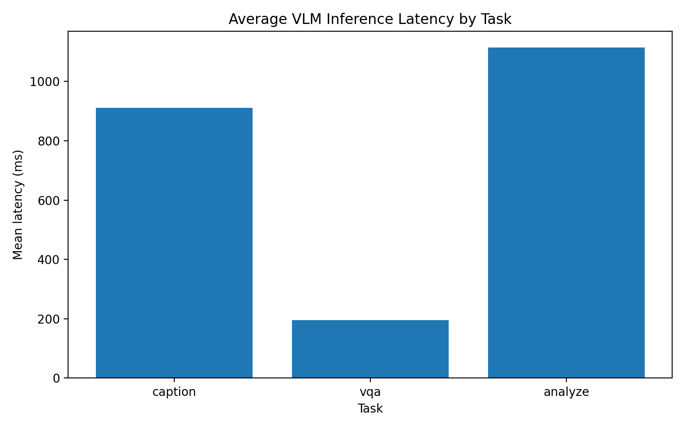

# Vision Language API

A multimodal vision language model (VLM) built with **FastAPI**, **PyTorch**, and **Hugging Face Transformers** for:

- **Image captioning**
- **Visual question answering (VQA)**
- **Combined image analysis via API**

## Features

- `POST /caption` — generate a caption for an uploaded image
- `POST /vqa` — answer a question about an uploaded image
- `POST /analyze` — generate both a caption and a visual answer
- `GET /health` — check API and model readiness
- Modular `src/` package layout
- Configurable settings with environment variables
- Evaluation script for latency 

## Tech Stack

- **FastAPI**
- **Transformers**
- **PyTorch**
- **Pillow**
- **Pydantic**

## Project Structure

```text
vision-language-api/
├── app/
│   └── main.py
├── src/
│       ├── __init__.py
│       ├── config.py
│       ├── exceptions.py
│       ├── logging_config.py
│       ├── schemas.py
│       ├── utils.py
│       └── services/
│           ├── __init__.py
│           └── model_service.py
├── scripts/
│   └── evaluate_latency.py
├── data/
│   └── examples/
│       └── dog.jpg
├── requirements.txt
├── Dockerfile 
└── README.md
```

## Quick Start 

Create a virtual environment: 

```bash
python3 -m venv venv
source venv/bin/activate
```

Install dependencies:

```bash
pip3 install -r requirements.txt
```

Start the API: 

```
uvicorn app.main:app --reload
```

Find the API:

```
http://127.0.0.1:8000
```

## Docker Setup

```bash

docker build -t vision-language-api .
docker run --rm -p 8000:8000 vision-language-api

```

## Sample Requests and Responses 

VQA request:



```bash
curl -X POST "http://127.0.0.1:8000/vqa" \
-F "image=@./venv/lib/python3.10/site-packages/networkx/drawing/tests/baseline/test_house_with_colors.png" \
-F "question=What is in the image?"
```
  
Response:



```json
{"filename":"test_house_with_colors.png",
"question":"What is in the image?",
"answer":"blue circle"}
```

Analysis request: 

```bash
curl -X POST "http://127.0.0.1:8000/analyze" \
-F "image=@./venv/lib/python3.10/site-packages/networkx/drawing/tests/baseline/test_house_with_colors.png" \
-F "question=What shapes are visible?"
```

Response: 

```json  
{"filename":"test_house_with_colors.png",
"caption":"an image of a triangle with three circles on it",
"question":"What shapes are visible?",
"answer":"circles"}
```

Caption request:

```bash 
curl -X POST "http://127.0.0.1:8000/caption" \
-F "image=@./venv/lib/python3.10/site-packages/networkx/drawing/tests/baseline/test_house_with_colors.png"
```
  
Response:



```json
{"filename":"test_house_with_colors.png",
"caption":"an image of a triangle with three circles on it"}
```

## Evaluation 

Evaluate the model's latency:

```bash
PYTHONPATH=. python3 scripts/evaluate_latency.py --dataset data/sample_latency_eval.json \
--repeats 5 --warmup-runs 2 --output-json data/latency_results.json --output-dir \
data/latency_plots \
```

## Evaluation Results 

The below plot visualizes the latency results from a sample evaluation run.



These results reveal that VQA is the quickest task on average at about 195ms, captioning is much slower at about 970ms, and analysis is the slowest at about 1.1s. Since analysis combines both VQA and captioning, its latency is normal. VQA only requires a targted answer, explaining its low latency. Captioning requires analysis of the entire image, making its latency normal. 


