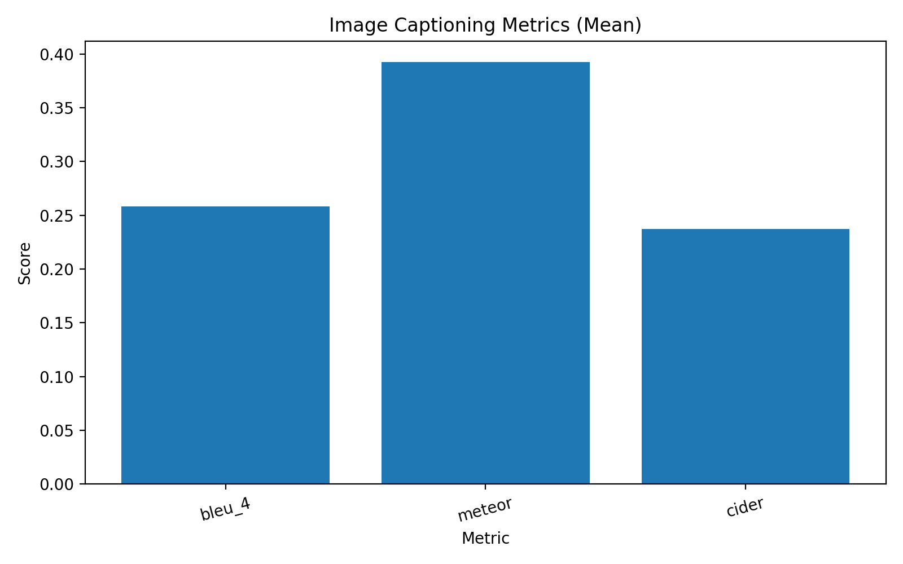
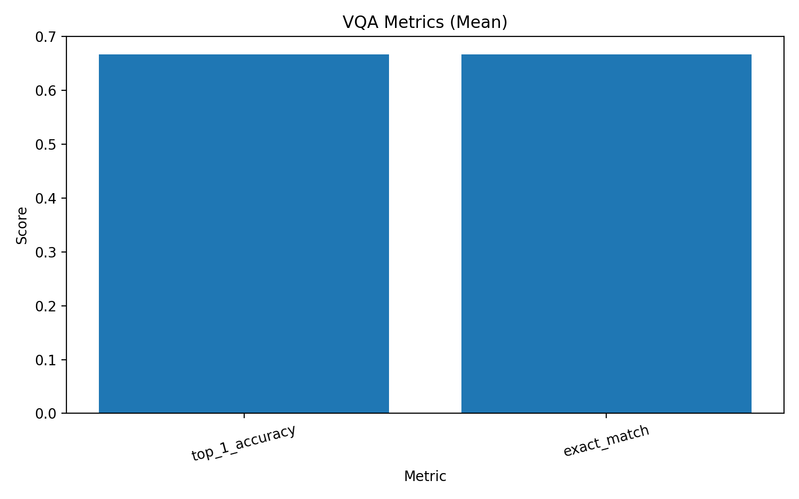
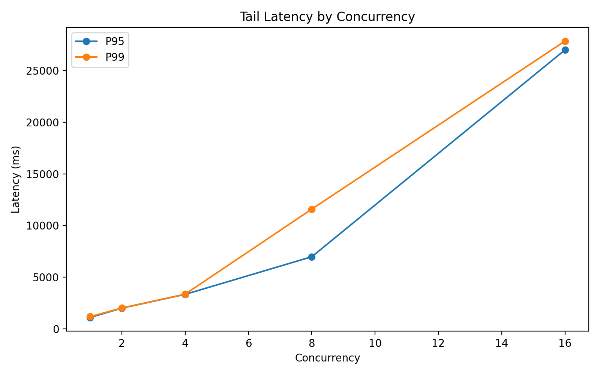

# Vision Language API

A multimodal vision language model (VLM) built with **FastAPI**, **PyTorch**, and **Hugging Face Transformers** for:

- **Image captioning**
- **Visual question answering (VQA)**
- **Combined image analysis via API**

## Features

- `POST /caption` — generate a caption for an uploaded image
- `POST /vqa` — answer a question about an uploaded image
- `POST /analyze` — generate both a caption and a visual answer
- `GET /health` — check API and model readiness
- Modular `src/` package layout
- Configurable settings with environment variables
- Evaluation script for latency 

## Tech Stack

- **FastAPI**
- **Transformers**
- **PyTorch**
- **Pillow**
- **Pydantic**

## Project Structure

```text
vision-language-api/
├── app/
│   └── main.py
├── src/
│       ├── __init__.py
│       ├── config.py
│       ├── exceptions.py
│       ├── logging_config.py
│       ├── schemas.py
│       ├── utils.py
│       └── services/
│           ├── __init__.py
│           └── model_service.py
├── scripts/
│   └── evaluate_latency.py
├── data/
│   └── examples/
│       └── dog.jpg
├── requirements.txt
├── Dockerfile 
└── README.md
```

## Quick Start 

Create a virtual environment: 

```bash
python3 -m venv venv
source venv/bin/activate
```

Install dependencies:

```bash
pip3 install -r requirements.txt
```

Start the API: 

```
uvicorn app.main:app --reload
```

Find the API:

```
http://127.0.0.1:8000
```

## Docker Setup

```bash

docker build -t vision-language-api .
docker run --rm -p 8000:8000 vision-language-api

```

## Sample Requests and Responses 

VQA request:



```bash
curl -X POST "http://127.0.0.1:8000/vqa" \
-F "image=@./venv/lib/python3.10/site-packages/networkx/drawing/tests/baseline/test_house_with_colors.png" \
-F "question=What is in the image?"
```
  
Response:



```json
{"filename":"test_house_with_colors.png",
"question":"What is in the image?",
"answer":"blue circle"}
```

Analysis request: 

```bash
curl -X POST "http://127.0.0.1:8000/analyze" \
-F "image=@./venv/lib/python3.10/site-packages/networkx/drawing/tests/baseline/test_house_with_colors.png" \
-F "question=What shapes are visible?"
```

Response: 

```json  
{"filename":"test_house_with_colors.png",
"caption":"an image of a triangle with three circles on it",
"question":"What shapes are visible?",
"answer":"circles"}
```

Caption request:

```bash 
curl -X POST "http://127.0.0.1:8000/caption" \
-F "image=@./venv/lib/python3.10/site-packages/networkx/drawing/tests/baseline/test_house_with_colors.png"
```
  
Response:



```json
{"filename":"test_house_with_colors.png",
"caption":"an image of a triangle with three circles on it"}
```

## Evaluations

Evaluate the model's latency:

```bash
PYTHONPATH=. python3 scripts/evaluate_latency.py --dataset data/sample_latency_eval.json \
--repeats 5 --warmup-runs 2 --output-json data/latency_results.json --output-dir \
data/latency_plots \
```

Evaluate the model's quality:

```bash
PYTHONPATH=. python3 scripts/evaluate_quality.py \
  --dataset data/sample_quality_eval.json \
  --output-json data/quality_results.json \
  --output-dir data/quality_plots
```

Evaluate the API's throughput:

```
PYTHONPATH=. python3 scripts/evaluate_throughput.py \
  --base-url http://127.0.0.1:8000 \
  --dataset data/sample_throughput_eval.json \
  --concurrency-levels 1 2 4 8 16 \
  --requests-per-level 40 \
  --warmup-requests 2 \
  --output-json data/throughput_results.json \
  --output-dir data/throughput_plots
```

## Latency Evaluation Results 

The below plot visualizes the latency results from a sample evaluation run.


These results reveal that VQA is the quickest task on average at about 195ms, captioning is much slower at about 970ms, and analysis is the slowest at about 1.1s. Since analysis combines both VQA and captioning, its latency is normal. VQA only requires a targted answer, explaining its low latency. Captioning requires analysis of the entire image, making its latency normal. 

## Model Quality Evaluation Results 

The below plots visualize the model's performance in captioning and VQA. 





For captioning:

- METEOR (~0.39) is the strongest of the three, which usually means the generated captions capture a fair amount of the same meaning or word choice as the references.
- BLEU-4 (~0.26) is lower, which suggests the model often does not match the exact 4-gram phrasing of the ground-truth captions.
- CIDEr (~0.24) is also fairly low, which suggests the captions are only getting limited agreement on the more informative or distinctive words that matter most for caption quality.

For VQA:

- Top-1 Accuracy (~0.67) and Exact Match (~0.67) are identical.
- This means that when the model is correct, it is giving the answer in exactly the same form as the reference, and when it is wrong, it is simply missing rather than giving a semantically similar variant.

These results indicate that the model is more reliable with VQA than it is with captioning. 

## API Throughput Evaluation Results 

The below plots visualize the API's throughput. 



At low concurrency, tail latency is manageable:
- Around 1–2 concurrent requests, P95/P99 are roughly 1–2 seconds
- At 4, both are around 3.3 seconds

After that, latency rises sharply:
- At 8, P95 jumps to ~7s and P99 to ~11.5s
- At 16, P95 is ~27s and P99 is ~28s

The takeaways from these results are:
- 4 concurrency is the last relatively stable point
- 8 and especially 16 produce severe worst-case latency and would likely feel too slow for real users
- Maximum sustainable concurrency for real users is 4 


